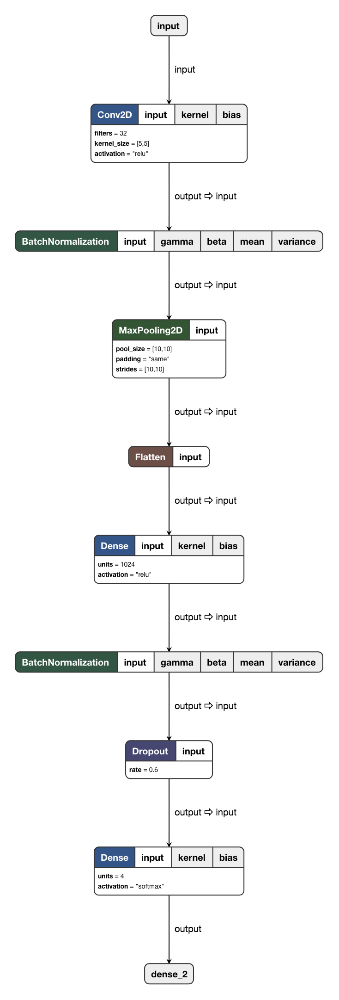

# Memojify
emojify  me now


Install requirements

``` python -r requirements.txt ```


[Colab Link](https://colab.research.google.com/drive/19aggyFm_dCngSMb74Z-9zWFSTHCL6PEf#scrollTo=QQKe1zNw_fty)

## Files and their usage:


* ``` model.py```
    * To train the model
    * outputs the model & weight in model directory
    * also outputs the graph having the logs of training
    * arguments -e/--epochs
        * pass the integer value of epochs

* ```get_images_from_webcam.py```

    * to create dataset using webcam (including all the  required subfolders)
    * It includes face alignment and face detection
    * argparse -l/--label
        * pass the argument like smile/wink/laugh according to your need

* ``` utils.py ```
    * contains useful required functions

* ``` memojifier.py```
    * It takes the stream of photos and converts the current emotion of the face into animated emoji

Current Network Architecture



Result: with validation accuracy of 80%


### synopsis:

Currently model is unstable and overfits easily (:funny)

Try to train the model with as many as possible images and different environment

this project is currently in experimental stage and will be worked upon


## Contributions:-
Got some issue? raise an issue and if you have something to contribute then just give a PR.

## Author

<table>
<tr>
<td>


        Amit Kumar

<p align="center">
<a href = "https://github.com/amit2rockon"></a>
<a href = "https://twitter.com/amit2rockon7"></a>
<a href = "https://www.linkedin.com/in/amit2rockon/"></a>
</p>
</td>
</tr>
</table>
